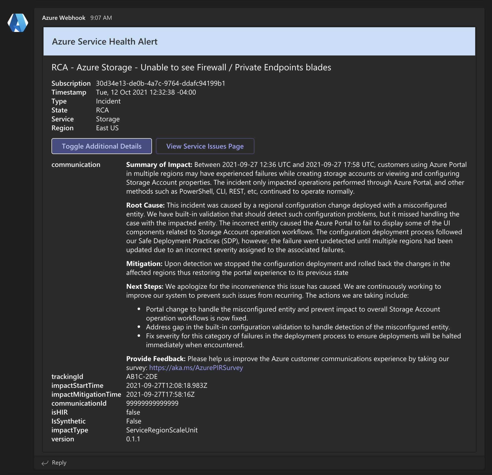
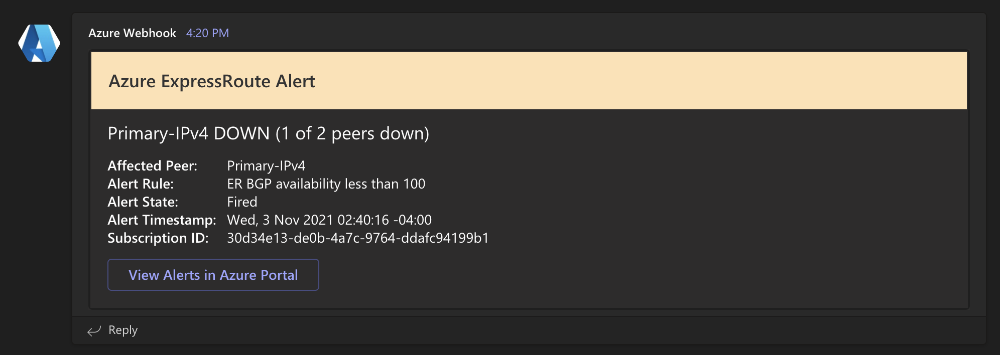
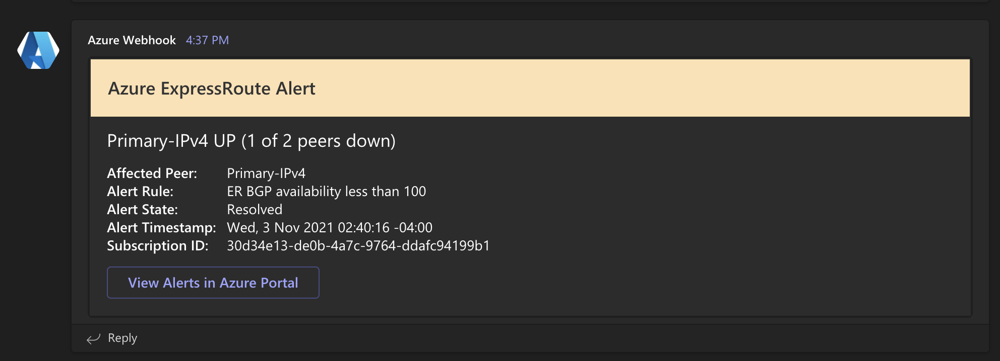
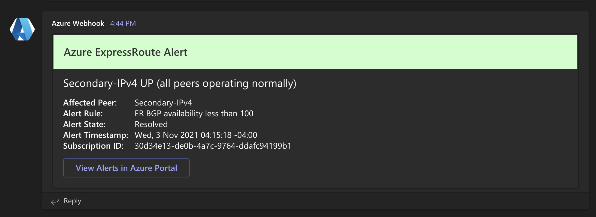
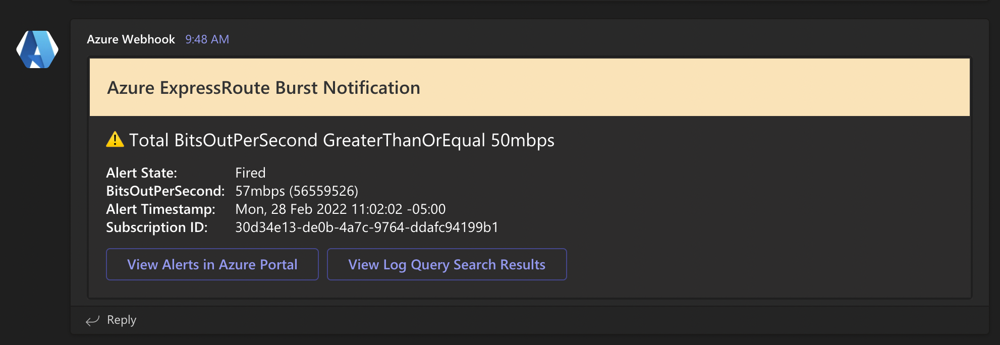
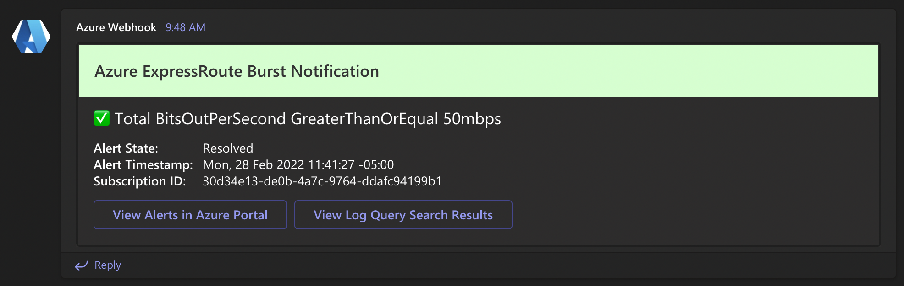
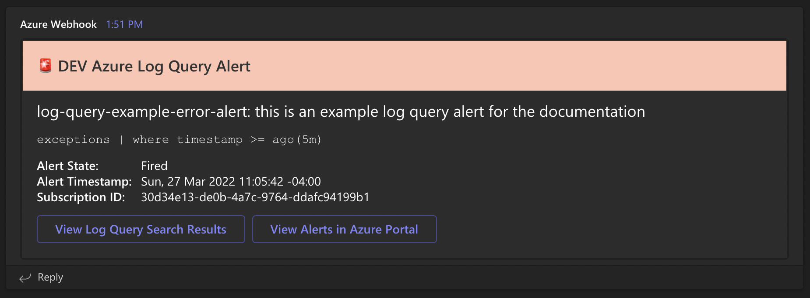
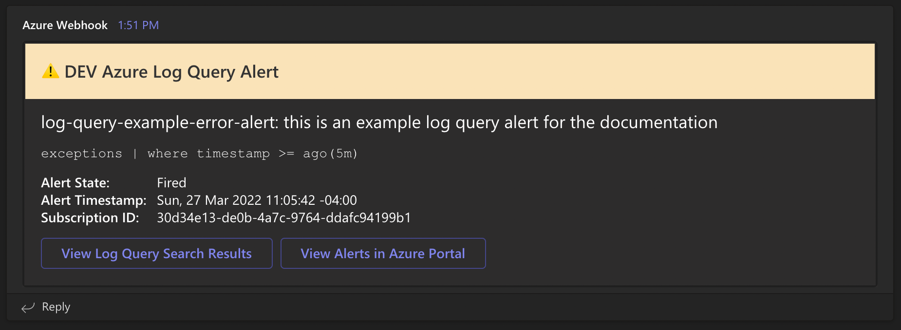
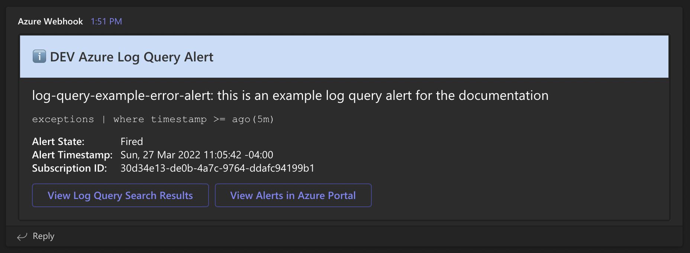

# az-common-alert-endpoint

Azure Function for an HTTP endpoint to receive Azure Monitor alerts that use the Common Alert Schema

| Branch | Status | CI/CD Build Trigger |
| --- | --- | --- |
| `dev` | [](https://github.com/cu-cit-cloud-team/az-common-alert-endpoint/actions/workflows/dev-build-and-deploy.yml) | Pushes to `dev` branch |
| `main` | [](https://github.com/cu-cit-cloud-team/az-common-alert-endpoint/actions/workflows/build-and-deploy.yml) | PR to `main` branch |

## Azure Function

### `alert-endpoint`

Accepts alert data from Azure Monitors using the Common Alert Schema - formats alert data
as an [AdaptiveCard](https://adaptivecards.microsoft.com/) and then sends it to an
[MS Teams Incoming Webhook](https://docs.microsoft.com/en-us/microsoftteams/platform/webhooks-and-connectors/how-to/add-incoming-webhook)

- Type: HTTP Trigger
- Auth: Anonymous
- Accepts:
  - Method: `POST`
  - Content-Type: `application/json`
  - Schema: `azureMonitorCommonAlertSchema`
    - [Definitions](https://docs.microsoft.com/en-us/azure/azure-monitor/alerts/alerts-common-schema-definitions)
    - [About](https://docs.microsoft.com/en-us/azure/azure-monitor/alerts/alerts-common-schema)
- Currently Supported Alerts
  - Azure Service Health Alert
    - [Schema](https://docs.microsoft.com/en-us/azure/azure-monitor/alerts/alerts-common-schema-definitions#monitoringservice--servicehealth)
    - Details:
      - Gives most important info at a glance
      - Color bar changes based on incident type/stage
      - Buttons to toggle additional details or go to service issues page in Azure Portal
      - HTML in communication converted to Markdown so it displays properly
    - Examples:
      - Collapsed
        
      - Full
        
  - ExpressRoute Platform Alert
    - [Schema](https://docs.microsoft.com/en-us/azure/azure-monitor/alerts/alerts-common-schema-definitions#monitoringservice--platform)
    - Details:
      - Gives most important info at a glance
      - Color bar changes based on alert type and number of peers affected
      - Button to go view the alert in the Azure Portal
    - Additional Notes/Requirements
      - Manages state using a JSON file (kept in Blob Storage inside the Function App's existing storage account)
      - You can specify the blob container (useful for dev vs prod) by setting an environment variable: `BLOB_CONTAINER_NAME`
        - Uses default value of `functions-data` if `BLOB_CONTAINER_NAME` is not provided
    - Examples
      - Primary Down
        
      - Secondary Down
        
      - Primary Up
        
      - Secondary Up
        
  - ExpressRoute Bursts via log query search
    - [Schema](https://docs.microsoft.com/en-us/azure/azure-monitor/alerts/alerts-common-schema-definitions#monitoringservice--log-alerts-v2)
    - Currently supports ExpressRoute BitsInPerSecond/BitsOutPerSecond Log Searches
      - Example query: `AzureMetrics | where MetricName == 'BitsOutPerSecond' and Maximum >= 50000000 | order by TimeGenerated desc | limit 10 | where TimeGenerated > ago(10m) | summarize BitsOutPerSecond = sum(Maximum) by TimeGenerated`
      - Details:
        - Gives most important info at a glance
        - Color bar and icon changes based on alert status
        - Button to go view the alert in the Azure Portal
        - Button to view the log query results in the Azure Portal
        - Currently set to fire if it's in violation for at least 2 of the last 3 evaluation periods (eval period is currently 5 minutes)
      - Examples:
        - Burst Notification
          
        - Resolved Notification
          

  - Log Queries (Application Insights Log Alert / Log Alerts V2)
    - Schemas
      - [Application Insights](https://docs.microsoft.com/en-us/azure/azure-monitor/alerts/alerts-common-schema-definitions#monitoringservice--application-insights)
      - [Log Alerts V2](https://docs.microsoft.com/en-us/azure/azure-monitor/alerts/alerts-common-schema-definitions#monitoringservice--log-alerts-v2)
    - Details
      - Generic heading identifies it as an Azure Log Query Alert
      - Color bar and icons change based on alert severity (alert severity is chosen during setup, it's a user controlled value)
      - Includes alert rule name, description (if provided), and log analytics search query to make it easier to grok what's alerting
      - Button to view the log query results in the Azure Portal
      - Button to view alert(s) in the Azure Portal
    - Examples
      - Sev1 (Alert)
        
      - Sev2 (Warning)
        
      - Sev3 (Informational) / Sev4 (Verbose)
        

## GitHub Repo Settings

- **Actions secrets:**
  - **REQUIRED**
    - `AZURE_FUNCTIONAPP_PUBLISH_PROFILE`
      - Publish profile for production function app
    - `AZURE_FUNCTIONAPP_PUBLISH_PROFILE_DEV`
      - Publish profile for dev function app
    - `MS_TEAMS_WEBHOOK_URL`
      - URL of MS Teams Incoming Webhook to be used for deploy notifications
    - `MS_TEAMS_WEBHOOK_URL_DEV`
      - URL of MS Teams Incoming Webhook to be used for dev function app deploy notifications (can be same as `MS_TEAMS_WEBHOOK_URL`)
    - `MS_TEAMS_ALERT_WEBHOOK_URL`
      - URL of MS Teams Incoming Webhook to be used for deploy failure notifications (can be same as `MS_TEAMS_WEBHOOK_URL`)
    - `ACTIONS_STEP_DEBUG`
      - `false` (set to `true` for additional debug output in GitHub Actions logs)
    - `ACTIONS_RUNNER_DEBUG`
      - `false` (set to `true` for additional debug output in GitHub Actions logs)

## Local Development

### Requirements

- Node.js >= v22.x
- npm >= v10.x

### Getting Started

1. Clone repo `git clone https://github.com/cu-cit-cloud-team/az-common-alert-endpoint.git your-folder-name`
1. Enter directory `cd your-folder-name`
1. Install dependencies `npm install`
1. Set up environment variables in `.env` and `local.settings.json`:
   - **REQUIRED**
     - `MS_TEAMS_NOTIFICATION_WEBHOOK_URL`
       - URL of MS Teams Incoming Webhook to be used for informational notifications
     - `MS_TEAMS_ALERT_WEBHOOK_URL`
       - URL of MS Teams Incoming Webhook to be used for actionable alerts (can be same as `MS_TEAMS_NOTIFICATION_WEBHOOK_URL`)
   - **OPTIONAL**
     - `MS_TEAMS_DEV_WEBHOOK_URL`
       - URL of MS Teams Incoming Webhook to be used for unsupported payloads and development - if not provided, function will fall back to `MS_TEAMS_NOTIFICATION_WEBHOOK_URL`
     - `NOTIFICATION_TIMEZONE`
       - Timezone db name to use for formatting timestamps in notifications - defaults to `America/New_York` ([full list](https://en.wikipedia.org/wiki/List_of_tz_database_time_zones#List))
     - `BLOB_CONTAINER_NAME`
       - Name of the Azure Blob container to use for storing state files - defaults to `functions-data`
     - `SUB_DISPLAY_NAME_IN_DESCRIPTION`
       - Used to indicate whether the SHA rule(s) have the subscription name in their description (value should be `true` or `false`)
     - `SUB_DISPLAY_NAME_SEPARATOR`
       - Some identifying text that can be used to extract the subscription name from the description if above value is true (e.g. ` for: ` if the description is "Some Alert Rule for: Subscription Name" and you wanted to extract "Subscription Name" for the SHA notification)
     - `LOCAL_DEV`
       - Set to `true` to override alert and notification webhooks during development
       - Make sure to also set up `MS_TEAMS_DEV_WEBHOOK_URL` with a value or it will fall back to `MS_TEAMS_NOTIFICATION_WEBHOOK_URL`
     - `WEBSITE_RUN_FROM_PACKAGE`
       - Change to `0` to _trick_ the runtime into reloading when changes are made (otherwise you have to manually stop and run again)

1. Run locally `npm run functions` (for verbose logging use `npm run functions:verbose`)

#### Posting Sample Data Using `curl`

Assumes functions are running locally using instructions above and you are in the root of the repo directory in your terminal

```bash
curl -X POST -H "Content-Type: application/json" --data "@assets/sample-data/service-health-alert.json" http://localhost:7071/api/alert-endpoint
```
